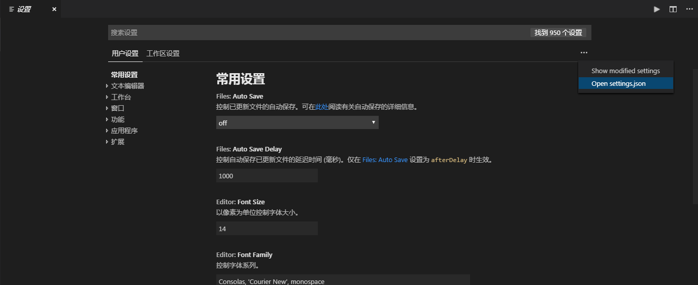

# 0.2.Visual Studio Code

<!-- TOC -->

- [0.2.Visual Studio Code](#02visual-studio-code)
  - [0 安装](#0-%E5%AE%89%E8%A3%85)
  - [1 使用](#1-%E4%BD%BF%E7%94%A8)
    - [1.1 打开setting.json](#11-%E6%89%93%E5%BC%80settingjson)
  - [2 插件](#2-%E6%8F%92%E4%BB%B6)
    - [2.1 插件安装](#21-%E6%8F%92%E4%BB%B6%E5%AE%89%E8%A3%85)
      - [2.1.1 在线安装](#211-%E5%9C%A8%E7%BA%BF%E5%AE%89%E8%A3%85)
      - [2.1.2 离线安装](#212-%E7%A6%BB%E7%BA%BF%E5%AE%89%E8%A3%85)
  - [3 常用插件介绍](#3-%E5%B8%B8%E7%94%A8%E6%8F%92%E4%BB%B6%E4%BB%8B%E7%BB%8D)
    - [3.1 中英文切换](#31-%E4%B8%AD%E8%8B%B1%E6%96%87%E5%88%87%E6%8D%A2)
      - [3.1.1 Chinese (Simplified) Language Pack for Visual Studio Code](#311-chinese-simplified-language-pack-for-visual-studio-code)
    - [3.2 Vue插件](#32-vue%E6%8F%92%E4%BB%B6)
      - [3.2.1 Vetur](#321-vetur)
    - [3.2.2 Eslint](#322-eslint)
    - [3.2.3 Prettier - Code formatter](#323-prettier---code-formatter)
    - [3.3 Python插件](#33-python%E6%8F%92%E4%BB%B6)
      - [3.3.0 代码检查](#330-%E4%BB%A3%E7%A0%81%E6%A3%80%E6%9F%A5)
      - [3.3.0.1 Pylint](#3301-pylint)
        - [[pylint] Constant name "urlpatterns" doesn't conform to UPPER_CASE naming style [C0103]](#pylint-constant-name-%22urlpatterns%22-doesnt-conform-to-uppercase-naming-style-c0103)
        - [[pylint] Unable to import 'xxx.xxx.xxx' [E0401]](#pylint-unable-to-import-xxxxxxxxx-e0401)
        - [[pylint] Module 'xxx' has no 'xxx' member' [E1101]](#pylint-module-xxx-has-no-xxx-member-e1101)
          - [解决方案1(待验证)](#%E8%A7%A3%E5%86%B3%E6%96%B9%E6%A1%881%E5%BE%85%E9%AA%8C%E8%AF%81)
          - [解决方案2(待验证)](#%E8%A7%A3%E5%86%B3%E6%96%B9%E6%A1%882%E5%BE%85%E9%AA%8C%E8%AF%81)
      - [3.3.1 Python](#331-python)
      - [3.3.2 Visual Studio IntelliCode](#332-visual-studio-intellicode)
    - [3.4 reStructuredText](#34-restructuredtext)
      - [3.4.1 LeXtudi.reStructuredText](#341-lextudirestructuredtext)
    - [3.5 Markdown](#35-markdown)
      - [3.5.1 Markdown All in One](#351-markdown-all-in-one)
      - [3.5.2 alanwalk.markdown-toc](#352-alanwalkmarkdown-toc)
  - [4 扩展](#4-%E6%89%A9%E5%B1%95)

<!-- /TOC -->

> 笔者机器为Windows系统，本篇内容主要为VSCode在Windows平台中的使用介绍。
>
> 版本
>
> VSCode: 
>
> ​	1.29.1
>
> ​	1.30.2

Visual Studio Code (简称 VS Code / VSC) 是一款免费开源的现代化轻量级代码编辑器。
软件跨平台支持 Win、Mac 以及 Linux，运行流畅。支持几乎所有主流的开发语言的语法高亮、智能代码补全、自定义快捷键、括号匹配和颜色区分、代码片段、代码对比 Diff、GIT命令 等特性，支持插件扩展，并针对网页开发和云端应用开发做了优化。

## 0 安装

软件下载地址: https://code.visualstudio.com/

下载Visual Studio Code安装包，按照windows系统安装软件方式安装软件即可。

## 1 使用

### 1.1 打开setting.json

> 使用工具菜单
> https://jingyan.baidu.com/article/e5c39bf5e89c3039d660336a.html
>
> 使用快捷键
> 1) Ctrl+Shift+P
> 2) 在输入栏中输入`Preferences: Open Workspace Settings`
> 3) 找到Open setting.json，打开配置文件
>
> 


## 2 插件

### 2.1 插件安装

#### 2.1.1 在线安装

#### 2.1.2 离线安装

* 参考
  * [VSCode 插件离线安装](https://blog.csdn.net/wangwei703/article/details/54020712)
  * [简单的 VSCode 插件离线安装方法](https://blog.csdn.net/u012814856/article/details/80684376)

1. 获取插件

插件下载地址: `https://marketplace.visualstudio.com/VSCode`

下载的插件格式后缀为`.vsix`

1. 安装

Window下进入cmd，执行`code --install-extension [test.vsix]`

> 前提： code命令已经添加到环境变量中（code命令路径为VSCode安装路径bin/目录下）

1. 重启VSCode

## 3 常用插件介绍

### 3.1 中英文切换

#### 3.1.1 Chinese (Simplified) Language Pack for Visual Studio Code

1. 安装 Chinese 插件

安装方式参考[2.1 插件安装](### 2.1 插件安装)

2. 

### 3.2 Vue插件

#### 3.2.1 Vetur

* 参考: [如何优雅地使用 VSCode 来编辑 vue 文件](https://www.clarencep.com/2017/03/18/edit-vue-file-via-vscode)

1. 安装 Vetur 插件

安装方式参考[2.1 插件安装](### 2.1 插件安装)

1. 安装eslint

```cmd
npm install -g eslint
npm install -g eslint-plugin-html
```

1. 配置

```
{
    // 支持vue文件的基本语法高亮
    "emmet.syntaxProfiles": {
        "vue-html": "html",
        "vue": "html"
    },
    // 配置ESLint
    "eslint.validate": [
        "javascript",
        "javascriptreact",
        "html",
        "vue"
    ],
    "eslint.options": {
        "plugins": ["html"]
    }
}
```

### 3.2.2 Eslint

### 3.2.3 Prettier - Code formatter

* [vscode + prettier 专治代码洁癖](https://blog.csdn.net/anxin_wang/article/details/81234214)

1. 安装 Prettier 插件

安装成功后，编辑器默认的格式化处理就会被prettier代替， 默认快捷键是alt + shift + f

1. 配置

### 3.3 Python插件

> 参考
>
> 1. [Vs code + python3.7环境搭建](https://blog.csdn.net/qq_19342635/article/details/82147972)
> 2. [Visual Studio Code中修改Pylint设置，及python版本切换](https://blog.csdn.net/yzh201612/article/details/68491707)
> 3. [解决忽略vscode中pylint报错的问题](https://blog.csdn.net/cowry5/article/details/79735845)
>
> 扩展
>
> 1. [VS Code官方提供的Python说明（英）](https://code.visualstudio.com/docs/languages/python) 
> 2. [VS Code中Python插件作者Don Jayamanne提供的说明（英）](https://github.com/DonJayamanne/pythonVSCode/wiki/Linting#pylint)
> 3. [如何使用 Pylint 来规范 Python 代码风格](https://www.ibm.com/developerworks/cn/linux/l-cn-pylint/)
>

#### 3.3.0 代码检查

#### 3.3.0.1 Pylint

pylint是VScode中python自带的插件，可以帮助代码规范，美观。 


* 使用pylint

> 配置setting.json

```json
{
    // 打开 pylint 检查
    "python.linting.pylintEnabled": true
}
```


* 报错

> pylint检查的有些报错是我们不想看到的，可以选择性的忽略。

##### [pylint] Constant name "urlpatterns" doesn't conform to UPPER_CASE naming style [C0103]

配置setting.json

```json
{
    "python.linting.pylintArgs": [
        "--disable-msg=C0103",
    ],
}
```

#####  [pylint] Unable to import 'xxx.xxx.xxx' [E0401]

配置setting.json

```json
{
    "python.linting.pylintArgs": [
        // [pylint] Unable to import 'xxx.xxx.xxx' [E0401]
        // pylint 无法 import 自定义的模块
        "--disable-msg=E0401",
    ],
}
```

#####  [pylint] Module 'xxx' has no 'xxx' member' [E1101]

   原因:  Pylint默认只信任来自标准库stdlib的C扩展，而忽略其他的。模块'xxx'不是stdlib的一部分，需要手动将其添加到白名单。

###### 解决方案1(待验证)

   1. 在terminal里 （例如Windows 平台的powershell）导航到项目所在目录；

   2. 为Pylint生成rcfile文件：

      ```bash
      pylint --generate-rcfile > .pylintrc
      ```

   3. 打开生成的文件.pylintrc，将模块名添加至白名单：extension-pkg-whitelist=xxx。以 lxml为例

   ```
   [MASTER]
   
   # A comma-separated list of package or module names from where C extensions may
   # be loaded. Extensions are loading into the active Python interpreter and may
   # run arbitrary code
   extension-pkg-whitelist=lxml
   ```

###### 解决方案2(待验证)

   配置setting.json

   ```json
{
    "python.linting.pylintArgs": [
        // E1101: Module 'xxx' has no 'xxx' member
        // Pylint默认只信任来自标准库stdlib的C扩展，而忽略其他的。模块'xxx'不是stdlib的一部分，需要手动将其添加到白名单。
        "--extension-pkg-whitelist=xxx",
    ],
}
   ```

#### 3.3.1 Python

1. 安装 VSCode Python 插件
2. 配置setting.json

```json
{
    // Python安装路径
	"python.pythonPath":"D:\\WindowsSoftware\\Python37\\python.exe",
}
```

#### 3.3.2 Visual Studio IntelliCode

> 代码自动补全功能

1. 安装 Visual Studio IntelliCode 插件
2. 配置setting.json

```json
{
    "python.autoComplete.extraPaths": [
        "D:\\WindowsSoftware\\Python37",
        "D:\\WindowsSoftware\\Python37\\Lib",
        "D:\\WindowsSoftware\\Python37\\Lib\\site-packages",
        "D:\\WindowsSoftware\\Python37\\DLLs"
    ]
}
```

### 3.4 reStructuredText

> 参考
>
> 1. [VS Code reStructuredText 找不到 conf.py 路径解决办法](https://blog.csdn.net/techfield/article/details/83041864)
>
> 扩展


#### 3.4.1 LeXtudi.reStructuredText

1. 安装 LeXtudi.reStructuredText 插件
2. 配置setting.json
3. 

### 3.5 Markdown

#### 3.5.1 Markdown All in One

#### 3.5.2 alanwalk.markdown-toc

自动生成目录

## 4 扩展

* [强大的 VS Code](https://www.imooc.com/article/39349)
* [vscode 配置 python3开发环境](https://blog.csdn.net/weixin_40528417/article/details/81141567)

