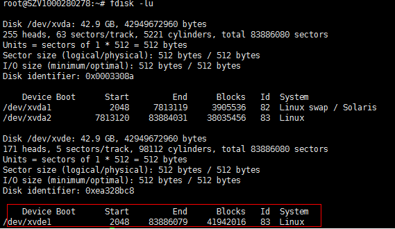

# 1.1.3.磁盘挂载

<!-- TOC -->

- [3.1.磁盘挂载](#31磁盘挂载)
    - [1 磁盘挂载之Linux](#1-磁盘挂载之linux)
        - [1.1 介绍](#11-介绍)
        - [1.2 分区创建](#12-分区创建)
            - [1.2.1 fdisk命令介绍](#121-fdisk命令介绍)
            - [1.2.2 创建新分区](#122-创建新分区)
        - [1.3 分区格式化](#13-分区格式化)
        - [1.4 分区挂载](#14-分区挂载)
        - [5. 永久挂载](#5-永久挂载)

<!-- /TOC -->

## 1 磁盘挂载之Linux

> 测试情况:
>
> ​	Ubuntu14.04: 亲测可用

### 1.1 介绍

* 查看是否有分区挂载 `df -TH`
* 查看是否有分区存在 `fdisk -lu`

如果存在下图中圈出的数据，说明分区创建了，可以直接格式化




### 1.2 分区创建

#### 1.2.1 fdisk命令介绍
	# m ：help
	# p ：打印分区表
	# n ：新建分区
	# w ；保存配置并退出fdisk

#### 1.2.2 创建新分区
	fdisk /dev/xvde #需要分区的盘   
	# p ：查看是否有分区以及其大小，判断是否需要创建新分区
	# n ：创建新分区，（出现 p 和 e命令，这里的p和fdisk开始的p不一样）输入p
	# partition number：创建分区编号
	# 接着自己设定分区开始以及结束柱号
	#
	# 完成之后使用 ：p  查看创建的分区
	# 如果确定，使用：w  保存退出

### 1.3 分区格式化
	#格式化分区
	mkfs -V -t ext4 -c /dev/xvde1

### 1.4 分区挂载
```bash
#创建目录: /home/E_xvde1/ 
# 将新创建的分区 /dev/xvde1 挂载目录上：
mount /dev/xvde1 /home/E_xvde1/
# 查看挂载情况
df -TH

# 取消挂载
umount /dev/xvde1
```

### 5. 永久挂载
```bash
#磁盘永久挂载
vim /etc/fstab
# 在最后添加挂载磁盘信息：
# 特别注意： 一定要仔细检查，不能写错否则关机之后就不能开机了
/dev/xvde1	/home/E_xvde1		ext4	defaults	1	1
# 重启生效

# 取消永久挂载
# 删除添加的行，重启
```

## 扩展

### linux之fstab文件详解

https://blog.csdn.net/richerg85/article/details/17917129

