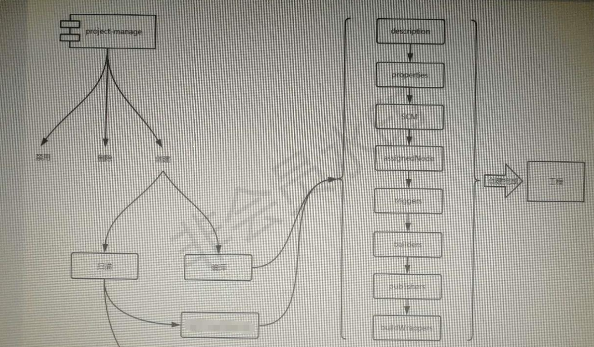
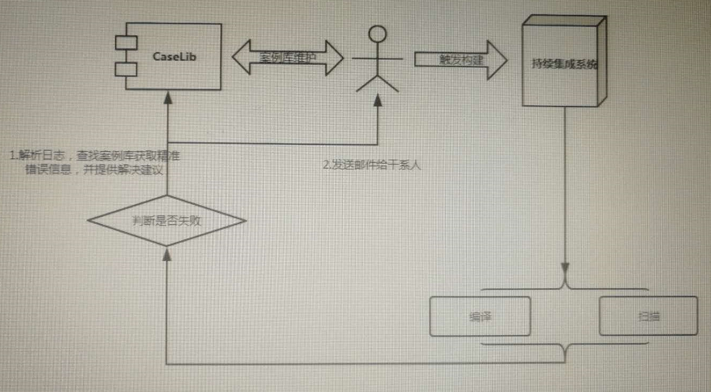

# Jenkins 最佳实践

- 插件使用
- Jenkins自动化

## 1 企业级Jenkins之精细化权限管理

在面临较复杂的组织结构时，需要设计合理的权限模型以实现精细化权限管理。这是在企业中规模化使用Jenkins需要解决的问题。我们在企业实践中基于Jenkins的Role Strategy Plugin插件的global roles、project roles、slave roles实现Jenkins 维护者、配置管理员、研发/测试用户的权限隔离与控制。

### 1.1 集成LDAP实现用户统一认证与用户组管理

权限管理的基础是用户信息与权限模型。在企业内，建议使用LDAP作为用户认证方式，可以统一用户认证和用户组信息，采用LDAP用户域组进行权限分组管理，还能避免每次都单独针对用户进行授权，在新员工入职时即确定其用户域组信息。安装LDAP Plugin后，在Configure Global Security的Security Realm中选择LDAP，参照如下图所示的配置即可实现LDAP登录。


这里有一个潜在的小问题，LDAP插件允许用户采用邮箱前缀（@之前的内容）和邮箱全名两种方式登录，但是这两种方式在Jenkins中属于两个用户，容易导致基于用户名的权限控制出现混淆。用户初次登录时，Jenkins_home目录下的users目录会为用户创建一个用户目录，排查问题时可以进行查看。

**TroubleShooting**

- Jenkins LDAP Plugin 配置说明，参考 https://wiki.jenkins.io/display/JENKINS/LDAP+Plugin
- Jenkins集成LDAP问题解决办法：AD and LDAP fail due to Referrals，参考 https://issues.jenkins-ci.org/browse/JENKINS-4895
- How to diagnose LDAP integration problems，参考 https://grandcentral.cloudbees.com/login

### 1.2 权限模型设计与实施

#### 1.2.1 原则

- 在全局权限中一般只能对Jenkins管理员、认证用户授权，还可以授权特殊权限的管理员
- 在项目权限中对项目管理员授权项目范围
- 在Slave权限中对Slave范围和权限内容进行授权

#### 1.2.2 组织结构与用户角色

权限模型的组织结构与用户角色如下图所示


由于公司研发部门存在众多产品研发团队，分属不同业务线，在组织上，研发部门设置DevOps团队负责全公司的运维能力，服务全公司的持续集成业务。

根据业务情况，将DevOps按责任模块划分为业务、平台、工具三部分并按小组管理。

- 业务组：负责使用平台组与工具组提供的平台与工具，实现配置管理任务，包括Job 配置 、代码管理（分支创建与合并），属于Jenkins用户方。
- 平台组：负责基于开源工具提供DevOps基础平台，包括Jenkins、SVN、虚拟化研发环境等的部署、架构和运维。其中Jenkins Admin团队负责Jenkins的运维与使用支持，包括系统配置、插件安装、Slave挂载与配置、配置管理与持续交付方案设计，属于Jenkins提供方。
- 工具组：负责研发内部编译工具，属于Jenkins用户方，主要是从自动化脚本中调用Jenkins，有固定账号。

#### 1.2.3 权限类型

面对上述场景，将权限类型和内容按照如下进行分类。

| 权限类型        | 权限内容                      |
| --------------- | ----------------------------- |
| Read权限        | 查看Job执行结果               |
| Build权限       | 查看、执行、取消执行Job       |
| Config权限      | 查看、执行、取消执行、配置Job |
| SlaveConfig权限 | 配置、连接、断开、删除Slave   |
| Admin权限       | 平台所有权限                  |

#### 1.2.4 Job 规范化管理

Job名称按照既定的规则进行规范化管理，比如product_projectnumber_projectnumber。这样规范的原因在于Jenkins需要依赖于Job名称进行权限的隔离，以便在匹配命名规则时可以使用正则表达式。

#### 1.2.5 Jenkins权限设计

- global roles：全局权限
- project roles：项目（即Job）级权限
- slave roles：Slave管理权限
- Promotion权限
- 其他权限

#### 1.2.6 内置角色

- anonymous： 匿名用户权限，无须登录即可使用
- authenticated： 认证用户权限，登录后即可获得的权限。

要求：禁止使用anonymous（匿名用户）权限，只能使用authenticated（认证用户）权限。

#### 1.2.7 权限表示例

> 在权限保密要求更高的情况下，可以在环境上进行物理隔离，单独部署Jenkins Master，并严格限制可访问的用户及权限。

**Manage Roles**

- Global roles

| 权限名称      | 权限内容                                                     | 用户（组）             | 说明               |
| ------------- | ------------------------------------------------------------ | ---------------------- | ------------------ |
| anonymous     | None                                                         | anonymous(Jenkins)     | 未登录用户         |
| authenticated | Overall-Read                                                 | authenticated(Jenkins) | 登录用户的基本权限 |
| developer     | Overall-Read, Job-Read\|Build\|Cancel, Run-Replay, View-All(Exclude: Delete) | developer(LDAP)        | 开发者权限         |
| scm           | All(Exclude: Delete)                                         | scm(LDAP)              | 配置管理员权限     |
| admin         | All                                                          | admin(LDAP)            | 系统管理员权限     |

- Project roles

| 权限名称      | 权限内容                            | 匹配策略 | 说明              |
| ------------- | ----------------------------------- | -------- | ----------------- |
| xxx_developer | Job-Read\|Build\|Cancel, Run-Replay | xxx_.*   | xxx产线开发者权限 |

- Slave roles

节点配置由 `SCM` 人员统一管理，使用 `Global roles` 中的 `scm` 权限。

**Assign Roles**

根据业务情况，给具体的用户根据权限规则进行合理分配。

## 2 企业级Jenkins之工程配置

> 参考：7

### 2.1 背景说明

公司研发部门工程配置由SCM统一维护，在涉及业务较多，部门间业务、技术栈等大不相同，频繁的项目变更，物理资源以及维护人力不足等现状下，为解决此类问题，需要提供良好的工程配置解决方案。

主要考虑以下几点问题：

- 多业务线，多项目，多技术栈
- 维护人力少
- 项目构建需求的频繁变更
- 快速解决问题

针对以上问题进行分析，按照以下标准进行实现：

- 规范项目名称：product_projectnumber_projectname
- 规范项目描述
- 规范构建日志和工作空间清理策略

### 2.2 project-manage工具说明

根据现状分析，工具需要频繁变更及调用，在进行架构设计的时候，根据Jenkins特点，结合业务情况，将工具进行模块化处理，结合多业务线场景，对各模块进行规范化处理，同时实现 `project-manage` 工具快速发布能力。

**工具处理流程**



## 3 企业级Jenkins之构建环境标准化、集群化、弹性化（未应用，待改进）

### 3.1 背景说明

在使用 `Jenkins` 进行 `CI/CD` 的时候，合理规划及使用节点资源，主要有以下几点目的：

- 提高资源利用率
- 提高高可用性
- 降低管理成本

公司当前的构建环境较为混乱，有 `Windows`、 `Linux` 和 `Docker` 多种模式，不利于统一维护管理。节点高可用性设计较差，抗风险能力弱。

### 3.2 解决方案

随着 `Docker` 的出现，软件工程能力获得了极大的成功。结合当前业界的先进能力，在企业级 `Jenkins` 的使用过程中，结合 `Docker`， 架设标准化、集群化、弹性化的Docker构建环境，解决当前遇到的问题，以及预防可能出现的风险。

**依赖插件**

- [CloudBees+Docker+Custom+Build+Environment+Plugin](https://wiki.jenkins.io/display/JENKINS/CloudBees+Docker+Custom+Build+Environment+Plugin)

**基础步骤**

- 制作构建依赖环境的 `Docker` 镜像，并将镜像上传到镜像仓库
- 结合 `CloudBees Docker Custom Build Environment` 插件，在工程配置中配置 `构建环境`

## 4 企业级Jenkins之基于SVN的集成构建（需实现）

对于软件开发来说，我认为有两点最重要的要素：质量和效率，所有的软件工程实践本质上都应该为此服务。

集成构建的核心理念是：

- 内建质量
- 缩短反馈周期

### 4.1 背景说明

#### 4.1.1 质量

在软件工程领域，质量是第一要素。

敏捷宣言也注重质量：“持续关注技术卓越和良好的设计提高敏捷性。”

内建质量实践确保每个增量的每个解决方案元素在整个开发过程中都符合适当的质量标准。它有助于避免与召回，返工和缺陷修复相关的延迟成本。内建质量理念应用系统思维来优化整个系统，确保整个价值流的快速流动，并保证每个人的工作质量。

当企业必须快速响应变化时，高质量的软件和系统更易于修改和调整。

#### 4.1.2 反馈周期

软件问题应该能够及时获取反馈，反馈的越早越好，问题包括编译是否通过、自动化测试是否通过，功能是否实现等，以便及时修复缺陷，提高开发效率。

### 4.2 集成构建

基于DevOps思维模式实现的集成构建，可以通过两个维度保障质量和效率。

#### 4.2.1 workflow

如何内建质量活动，以保证软件质量。

Jenkins workflow 主要基于内建质量活动，以保证软件质量。包括但不限于：

- 静态扫描
- 编译打包
- UT测试
- 安装部署
- 冒烟测试
- 自动化测试
- ……


#### 4.2.2 buildtype

- 开发过程
  - 每日集成构建（DailyBuild）
  - 门禁级构建（EntranceGuard）
  - 个人级构建（Persional）
- 项目发布
  - 版本级构建

##### 4.2.2.1 开发过程构建

**每日构建**

每日集成构建的核心是 `"One Build, One Test, One Day"`，即"每日一次构建、一次测试"。

每日构建流程根据业务需求选择 `4.2.1 workflow` 中的活动。

（待整理）Build-Test-Promotion方案

基本步骤：

在上述过程中，如果自动化测试发现缺陷，由于此类问题的优先级是最高的，所以会自动以最高优先级上报到Jira中，并按模块分配给研发工程师，团队会第一时间解决之。

上图中黑色圆圈中的步骤对应的代码每隔2小时会被构建一次，每天构建12次，每次构建都是一个完整的编译、打包、测试、反馈过程。在此过程中，作为缺陷库的Jira和作为制品库的FTP是两个非常重要的基础设施，整个过程由Jenkins负责驱动。

**门禁级构建**

在使用 `DailyBuild` 的管理方式下，一旦失败，就会导致第二天测试团队无包可测的情况，研发团队修复构建的周期也较长。为了解决这样的问题，`DevOps` 团队基于持续集成、质量门等实践，使用 `Jenkins` 的 `Promoted Builds Plugin` 实施了门禁级构建方案（如下图所示），实现多层质量门禁，包括提交验证、代码准入、制品升级等。整体方案中的三个步骤对应了三个角色：研发工程师、DevOps工程师与测试工程师。


门禁级构建降低了延迟集成问题的风险及其对系统质量和程序可预测性的影响，对树立团队质量意识、遵守持续集成规范有明显的促进作用，团队文化逐渐得到了改善，能够及时响应自动化构建和自动化测试失败的问题，同时不影响他人的工作。

在此基础上，我们持续完善，增加Preflight（个人级构建）的方案，以便在研发环境中提供更早更及时的反馈，同时也避免后续资源的浪费。

**个人级构建**

在项目资源允许的情况下，增加个人级构建，开发人员用以配合门禁级构建使用。

##### 4.2.2.2 发布构建

**版本级构建**

## 5 企业级Jenkins之精准化通知

> 参考：26

### 5.1 背景说明

在项目开发或发布的过程中，如果有编译、静态检查等情况发生时，相关责任人希望能够第一时间接收到通知，并根据错误提示，迅速定位并解决问题。

随着自动化通知能力带来的优势外，在工作中也经常出现如下问题：

- 构建通知邮件的滥发，导致容易忽视某些重要通知
- 日志解析不明显
- 编译出错的情况下如何快速定位问题，并及时通知到个人

在编译出错的情况下，如何能从大量的日志信息中捕获关键信息，快速定位问题及相关源文件，以及提供常见问题的解决方案，并将相关内容发送给用户期望的相关干系人，这些问题成为项目干系人非常关注的几点。

为解决以上问题，基于过往公司的实践经验，结合社区的思想，实现了集解析日志、定位问题、问题案例推送、锁定干系人，以及有效避免邮件滥发的问题于一身的功能。希望能通过行为来改变研发团队文化，同时解放无谓的人工体力。

### 5.2 auto-solution工具说明

**问题反馈流程图**

项目人员在完成项目编码之后通过持续集成系统进行编译和静态扫描工程构建，如果出现失败，则通过编译、扫描错误日志与维护的案例库进行错误日志分析及建议解决方案获取，并将结果通过邮件通知到相关干系人。



**基本实现方法**

get_solution_html(mysql_agile, build_url, err_info_file, mode)：获取解决方案信息

get_html_msg(df_html, build_url, err_info_file)：生成完整邮件信息内容

get_staffs(sql_agile, build_url)：获取项目关键成员

get_recipients(server, build_url)：获取工程配置成员

get_receivers(sql_agile, recipients)：根据项目干系人信息获取待发送人员邮件信息

send_mail(html_msg, build_url, receivers, mode, stage)：发送邮件

**邮件通知内容展示**


### 5.3 后续规划

目前业务只实现项目级构建，未具备个人级构建能力，所以此工具目前只针对项目级构建进行说明。后续规划需要结合Jenkins每日集成构建进行处理。


根据上图所示，开发人员在完成编码和本地测试之后将代码提交到代码库，持续集成服务器实时监测代码库变更，一旦有新的代码提交即触发代码编译、开发测试、安装部署、验收测试，如果出现失败，则通过代码提交信息和错误信息识别出是哪个人的哪一次提交（定位到个人和代码）破坏了本次构建或者测试，并用邮件和短信通知到开发者个人，提醒及时修复。

## 6 企业级Jenkins之数据备份方案

> 参考：18

Jenkins 应用是基于文件系统的，所有的配置和数据都存储在文件系统上。因此Jenkins Home目录的数据备份和恢复方案是Jenkins运维保障必须要有的。

首先，要理解Jenkins Home 下文件结构的含义（如下图所示），这样才能有效甄别出需要备份的有效数据。

### 6.1 Jenkins Home

Jenkins Home 目录下文件结构说明如下，数据备份只需要备份其中的有效数据即可。


### 6.2 备份方案

可以根据业务需求，选择一种或多种备份方案结合使用，确保有效数据得到备份。

常用的备份方案主要有三种：

- 基于 `Jenkins Backup Plugin` 插件进行备份
- 基于 `rsync` 工具将 `Jenkins Home` 数据同步到远程服务器进行备份
- 基于版本控制系统的增量备份方案

#### 6.2.1 Jenkins Backup Plugin

基于 `Jenkins Backup` 插件进行备份，对 `Jenkins Home` 下特定数据可以归档备份，而且还提供恢复功能。所有操作可以通过 `Jenkins` 管理界面完成，归档数据保存在 `Jenkins Master` 服务器上。

#### 6.2.2 rsync

为了避免 `Jenkins Master` 单点故障，可以使用 `rsync` 工具将 `Jenkins Home` 数据同步到远程服务器进行备份。利用rsync工具的 `--exclude-from=FILE` 功能定制一个 `exclude` 文件，过滤掉无须备份的数据，比如一般而言， `build` 目录下的内容不建议备份。

#### 6.2.3 版本控制系统

这种方法基于的是版本控制系统的备份方法，通过版本控制系统将需要备份的文件增量备份到版本仓库中。在使用 `Git` 工具时，还可以通过 `.gitignore` 文件过滤掉无须备份的文件。

此种方案相比前两种，有以下几点好处：

- 增量备份，能够避免归档备份等冗余备份对CPU、Disk的浪费
- 理论上可以恢复到所有历史版本，具体取决于备份频率。

**使用SVN作为备份仓库的基本步骤**

- 创建 `SVN` 仓库，将它用作 `Jenkins Home` 远程备份仓库
- 设置 `SVN` 仓库权限，确保 `Jenkins` 账户具有 `commit` 权限
- 获取 `SVN` 仓库内容到指定目录，并将 `Jenkins Home` 中需要备份的内容拷贝到仓库所在目录
- 将本地仓库内容 `commit` 到远程仓库中
- 创建定时任务，实现定时周期性备份

**使用SVN工具时的备份脚本**

```bash
#!/bin/bash
set -ex

cd /home/jenkins
rm -rf /home/jenkins/jenkins_backup
svn checkout http://x.x.x.x/svn/jenkins_backup /home/jenkins/jenkins_backup
rm -rf /home/jenkins/jenkins_backup/*
cp -rf /home/jenkins/jenkins_home/* /home/jenkins/jenkins_backup/
rm -rf /home/jenkins/jenkins_backup/workspace
svn add --all
svn commit -m "Jenkins backup at ${date}"
```

## 7 Jenkins Pipeline与BlueOcean实现可视化部署流水线，实现持续交付与DevOps


## 8 Jenkins自动化

### 8.1 工作空间清理工具

### 8.2 工程配置变更

## 9 更新记录

```
2019.05.13: 初稿
```