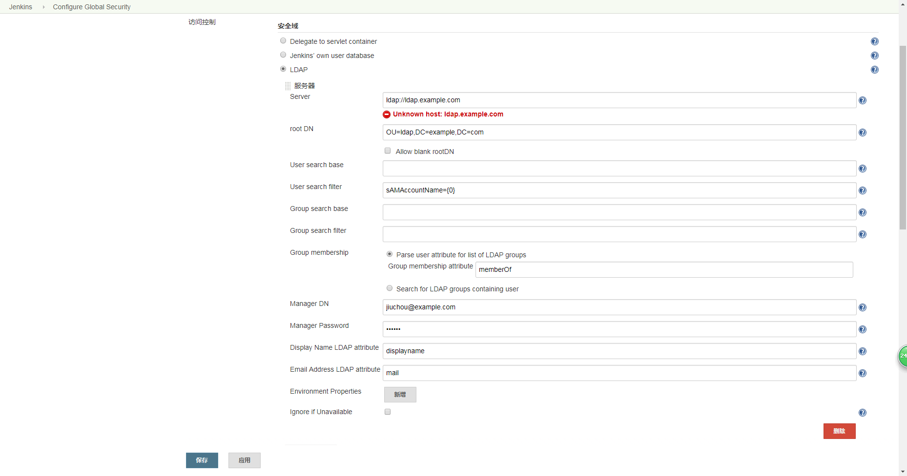
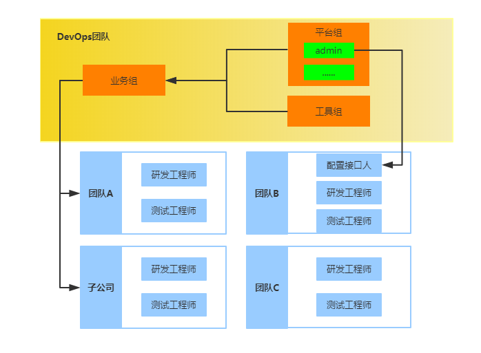

# Jenkins 最佳实践

* 插件使用
* Jenkins自动化

## 1 企业级Jenkins之精细化权限管理（需整理，待改进）

在面临较复杂的组织结构时，需要设计合理的权限模型以实现精细化权限管理。这是在企业中规模化使用Jenkins需要解决的问题。我们在企业实践中基于Jenkins的Role Strategy Plugin插件的global roles、project roles、slave roles实现Jenkins 维护者、配置管理员、研发/测试用户的权限隔离与控制。

### 1.1 集成LDAP实现用户统一认证与用户组管理

> 参考：5、6

权限管理的基础是用户信息与权限模型。在企业内，建议使用LDAP作为用户认证方式，可以统一用户认证和用户组信息，采用LDAP用户域组进行权限分组管理，还能避免每次都单独针对用户进行授权，在新员工入职时即确定其用户域组信息。安装LDAP Plugin后，在Configure Global Security的Security Realm中选择LDAP，参照如下图所示的配置即可实现LDAP登录。



这里有一个潜在的小问题，LDAP插件允许用户采用邮箱前缀（@之前的内容）和邮箱全名两种方式登录，但是这两种方式在Jenkins中属于两个用户，容易导致基于用户名的权限控制出现混淆。用户初次登录时，Jenkins_home目录下的users目录会为用户创建一个用户目录，排查问题时可以进行查看。

**TroubleShooting**

* Jenkins LDAP Plugin 配置说明，参考 https://wiki.jenkins.io/display/JENKINS/LDAP+Plugin

* Jenkins集成LDAP问题解决办法：AD and LDAP fail due to Referrals，参考 https://issues.jenkins-ci.org/browse/JENKINS-4895

* How to diagnose LDAP integration problems，参考 https://grandcentral.cloudbees.com/login

### 1.2 权限模型设计与实施

#### 1.2.1 原则

* 在全局权限中一般只能对Jenkins管理员、认证用户授权，还可以授权特殊权限的管理员
* 在项目权限中对项目管理员授权项目范围
* 在Slave权限中对Slave范围和权限内容进行授权

#### 1.2.2 组织结构与用户角色

权限模型的组织结构与用户角色如下图所示



由于公司研发部门存在众多产品研发团队，分属不同业务线，在组织上，研发部门设置软件配置管理（SCM）子部门负责公司的配置管理业务，服务全公司的持续集成业务。

在业务上，根据业务情况，将SCM分为业务、平台、工具三部分并按小组管理。

* 业务负责人：负责使用平台组与工具组提供的平台与工具，实现配置管理任务，包括Job 配置 、代码管理（分支创建与合并），属于Jenkins用户方。
* 平台负责人：负责基于开源工具提供配置管理基础平台，包括Jenkins、SVN、虚拟化研发环境等的部署、架构和运维。其中Jenkins Admin团队负责Jenkins的运维与使用支持，包括系统配置、插件安装、Slave挂载与配置、配置管理与持续交付方案设计，属于Jenkins提供方。
* 工具负责人：负责研发内部编译工具，属于Jenkins用户方，主要是从自动化脚本中调用Jenkins，有固定账号。

#### 1.2.3 权限类型

面对上述场景，将权限类型和内容按照如下进行分类。

| 权限类型        | 权限内容                      |
| --------------- | ----------------------------- |
| Read权限        | 查看Job执行结果               |
| Build权限       | 查看、执行、取消执行Job       |
| Config权限      | 查看、执行、取消执行、配置Job |
| SlaveConfig权限 | 配置、连接、断开、删除Slave   |
| Admin权限       | 平台所有权限                  |

#### 1.2.4 Job 规范化管理

Job名称按照既定的规则进行规范化管理，比如product_projectnumber_projectnumber。这样规范的原因在于Jenkins需要依赖于Job名称进行权限的隔离，以便在匹配命名规则时可以使用正则表达式。

#### 1.2.5 Jenkins权限设计

* global roles：全局权限
* project roles：项目（即Job）级权限
* slave roles：Slave管理权限
* Promotion权限
* 其他权限

#### 1.2.6 内置角色

* anonymous： 匿名用户权限，无须登录即可使用
* authenticated： 认证用户权限，登录后即可获得的权限。

要求：禁止使用anonymous（匿名用户）权限，只能使用authenticated（认证用户）权限。

#### 1.2.7 权限表示例

> 在权限保密要求更高的情况下，可以在环境上进行物理隔离，单独部署Jenkins Master，并严格限制可访问的用户及权限。

| 权限名称      | 权限内容     | 用户（组）             | 解释               |
| ------------- | ------------ | ---------------------- | ------------------ |
| authenticated | Overall-Read | authenticated(Jenkins) | 登录用户的基本权限 |
| jenkins-admin | All | Jenkins Admin(LDAP)|Jenkins系统管理员权限 |
| scm-admin | Job-All, Slave-Build, Connect, Run-All, View-All(Exclude Delete), Promotion-All, Overall-Read, RunScripts, Trigger, Retrigger | SCM Team | SCM团队成员权限，可以管理所有Job |
|developer | Overall-Read, Job-Read, Build, Cancel, Run-Delete, Update | 特定用户账号 | 特殊账号 |

## 2 企业级Jenkins之工程配置

> 参考：7


## 3 企业级Jenkins之构建环境标准化、集群化、弹性化（需整理，待改进）


## 4 企业级Jenkins之每日集成构建（需实现）

未实现

> 待整理内容如下
>
> 采用DailyBuild的方式管理构建，“One Build,One Test,One Day”，即“一天一次构建一次测试”。
>
> 在这种管理方式下，一旦DailyBuild失败，就会导致第二天测试团队无包可测的情况，研发团队修复构建的周期也较长。为了解决这样的问题，SCM团队基于持续集成、质量门等实践，使用Jenkins的Promoted Builds Plugin实施了 Build-Test-Promotion 方案（如下图所示），实现多层质量门禁，包括提交验证、代码准入、制品升级等。整体方案中的三个步骤对应了三个角色：研发工程师、配置管理与测试工程师。 该方案基于的核心理念就是内建质量于构建，以及缩短反馈周期。
>
> * 内建质量于构建：就是在构建结束立即进行自动化测试，而不是等待统一的手工测试。
> * 缩短反馈周期：研发在提交代码后需要及时获取反馈，包括编译是否通过、自动化测试是否通过，以便及时修复缺陷。
>
> 
>
> 基于Build-Test-Promotion的协作过程示意图如下所示，各步骤分别介绍如下。
>
> 
>
> 基本步骤：
>
> 1. 研发工程师在完成代码编写后，将代码提交到Gerrit中（如果未进行正式分支，则存储在Gerrit暂存区中）。
> 2. 研发工程师可以手动执行预编译任务，以判断自己新提交的代码是否会破坏构建。
> 3. Jenkins定时任务也会每2小时执行一次自动化的预编译任务，并针对构建出的软件版本包进行基础型的冒烟测试，判断最核心功能是否被破坏，自动化预编译结果也会回写到Gerrit中以便进行Code Review。
> 4. 确认无误后，通过Code Review，代码会被合并到正式分支，如Master分支。
> 5. Jenkins定时任务会每2小时持续构建一次，获取正式分支的代码进行编译打包，输出构件（即软件版本包）并触发相对完整的自动化冒烟测试，验证核心功能（比如账号系统等）是否都正常，研发工程师每2小时即可获取反馈，了解自己新提交的代码是否通过了构建和测试。核心目的是保证代码一直是可编译的、软件版本包是可测试的，不会出现软件版本包无法安装等问题。持续构建每天会运行12次，由于是全球化研发，持续有代码提交，所以基本上每次运行都会有新版本产生，并会被存储到临时的制品库， 等待进一步的质量验证。
> 6. 每天早上6:30系统会自动执行拣选任务，从过去一天中的12个版本中挑选符合条件的版本，推送到生产制品库，并运行更严格的可用性测试，通过后即推送给测试工程师进行手工测试。因为拣选的存在，基本上每天都能保障有符合要求的新版本包可进行测试，即便最近的代码被破坏了，还有上一次的软件版本包可以进行测试。
>
> 在上述过程中，如果自动化测试发现缺陷，由于此类问题的优先级是最高的，所以会自动以最高优先级上报到Jira中，并按模块分配给研发工程师，团队会第一时间解决之。
>
> 上图中黑色圆圈中的步骤对应的代码每隔2小时会被构建一次，每天构建12次，每次构建都是一个完整的编译、打包、测试、反馈过程。在此过程中，作为缺陷库的Jira和作为制品库的FTP是两个非常重要的基础设施，整个过程由Jenkins负责驱动。
>
> 实践表明，Build-Test-Promotion对树立团队质量意识、遵守持续集成规范有明显的促进作用，团队文化逐渐得到了改善，能够及时响应自动化构建和自动化测试失败的问题，同时不影响他人的工作。在此基础上，我们持续完善，增加Preflight的方案，以便在研发环境中提供更早更及时的反馈，同时也避免后续资源的浪费。

## 5 企业级Jenkins之精准化通知

> 参考：26

### 5.1 背景说明

在项目开发或发布的过程中，如果有编译、静态检查等情况发生时，相关责任人希望能够第一时间接收到通知，并根据错误提示，迅速定位并解决问题。

随着自动化通知能力带来的优势外，在工作中也经常出现如下问题：

* 构建通知邮件的滥发，导致容易忽视某些重要通知
* 日志解析不明显
* 编译出错的情况下如何快速定位问题，并及时通知到个人

在编译出错的情况下，如何能从大量的日志信息中捕获关键信息，快速定位问题及相关源文件，以及提供常见问题的解决方案，并将相关内容发送给用户期望的相关干系人，这些问题成为项目干系人非常关注的几点。

为解决以上问题，基于过往公司的实践经验，结合社区的思想，实现了集解析日志、定位问题、问题案例推送、锁定干系人，以及有效避免邮件滥发的问题于一身的功能。希望能通过行为来改变研发团队文化，同时解放无谓的人工体力。

### 5.2 auto-solution工具说明

> 目前业务只实现项目级构建，未具备个人级构建能力，所以此工具目前只针对项目级构建进行说明。
>
> 后续规划：
>
> 开发人员在完成编码和本地测试之后将代码提交到代码库，持续集成服务器实时监测代码库变更，一旦有新的代码提交即触发代码编译、开发测试、安装部署、验收测试，如果出现失败，则通过代码提交信息和错误信息识别出是哪个人的哪一次提交（定位到个人和代码）破坏了本次构建或者测试，并用邮件和短信通知到开发者个人，提醒及时修复。
>
> 

**问题反馈流程图**

待补充

**基本实现方法**

待补充

**邮件通知内容所示**

待补充

## 6 企业级Jenkins之数据备份方案

> 参考：18

Jenkins 应用是基于文件系统的，所有的配置和数据都存储在文件系统上。因此Jenkins Home目录的数据备份和恢复方案是Jenkins运维保障必须要有的。

首先，要理解Jenkins Home 下文件结构的含义（如下图所示），这样才能有效甄别出需要备份的有效数据。

### 6.1 Jenkins Home

Jenkins Home 目录下文件结构说明如下，数据备份只需要备份其中的有效数据即可。


### 6.2 备份方案

可以根据业务需求，选择一种或多种备份方案结合使用，确保有效数据得到备份。

常用的备份方案主要有三种：

* 基于 `Jenkins Backup Plugin` 插件进行备份
* 基于 `rsync` 工具将 `Jenkins Home` 数据同步到远程服务器进行备份
* 基于版本控制系统的增量备份方案

#### 6.2.1 Jenkins Backup Plugin

基于 `Jenkins Backup` 插件进行备份，对 `Jenkins Home` 下特定数据可以归档备份，而且还提供恢复功能。所有操作可以通过 `Jenkins` 管理界面完成，归档数据保存在 `Jenkins Master` 服务器上。

#### 6.2.2 rsync

为了避免 `Jenkins Master` 单点故障，可以使用 `rsync` 工具将 `Jenkins Home` 数据同步到远程服务器进行备份。利用rsync工具的 `--exclude-from=FILE` 功能定制一个 `exclude` 文件，过滤掉无须备份的数据，比如一般而言， `build` 目录下的内容不建议备份。

#### 6.2.3 版本控制系统

这种方法基于的是版本控制系统的备份方法，通过版本控制系统将需要备份的文件增量备份到版本仓库中。在使用 `Git` 工具时，还可以通过 `.gitignore` 文件过滤掉无须备份的文件。

此种方案相比前两种，有以下几点好处：

* 增量备份，能够避免归档备份等冗余备份对CPU、Disk的浪费
* 理论上可以恢复到所有历史版本，具体取决于备份频率。

**使用SVN作为备份仓库的基本步骤**

* 创建 `SVN` 仓库，将它用作 `Jenkins Home` 远程备份仓库
* 设置 `SVN` 仓库权限，确保 `Jenkins` 账户具有 `commit` 权限
* 获取 `SVN` 仓库内容到指定目录，并将 `Jenkins Home` 中需要备份的内容拷贝到仓库所在目录
* 将本地仓库内容 `commit` 到远程仓库中
* 创建定时任务，实现定时周期性备份

**使用SVN工具时的备份脚本**

```bash
#!/bin/bash
set -ex

cd /home/jenkins
rm -rf /home/jenkins/jenkins_backup
svn checkout http://x.x.x.x/svn/jenkins_backup /home/jenkins/jenkins_backup
rm -rf /home/jenkins/jenkins_backup/*
cp -rf /home/jenkins/jenkins_home/* /home/jenkins/jenkins_backup/
rm -rf /home/jenkins/jenkins_backup/workspace
svn add --all
svn commit -m "Jenkins backup at ${date}"
```

## 7 Jenkins Pipeline与BlueOcean实现可视化部署流水线，实现持续交付与DevOps


## 8 更新记录

```
2019.05.13: 初稿
```

