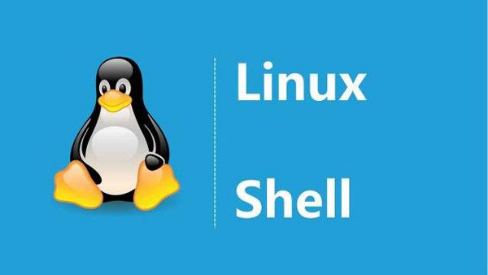

# Shell

linux
https://distrowatch.com/table.php?distribution=ubuntukylin

优麒麟
https://www.ubuntukylin.com/index.php


bash和sh的区别
https://www.cnblogs.com/hopeworld/archive/2011/03/29/1998488.html


Virtual Box使用

Linux介绍
http://baijiahao.baidu.com/s?id=1597911999197622652&wfr=spider&for=pc

coverity
https://stackoverflow.com/questions/37181873/intermediate-directory-contains-no-translation-units-error-while-coverity-stat

Docker学习总结之Run命令介绍
http://www.cnblogs.com/vikings-blog/p/4238062.html

Docker -v 对挂载的目录没有权限 Permission denied
https://blog.csdn.net/u012326462/article/details/81038446


系统监控工具介绍

https://www.cnblogs.com/mengdeep/p/5296991.html

Shell 脚本实现 Linux 系统监控(基于monitor)

https://blog.csdn.net/dahunihao/article/details/77844906

Linux学习进阶路线图

http://www.nowamagic.net/librarys/veda/detail/2054

https://blog.csdn.net/zdwzzu2006/article/details/4334791

http://www.ttlsa.com/linux/linux-system-worth-studying-and-road-map/

ubuntu 介绍

https://www.jianshu.com/p/0ae245cfe1cf?utm_campaign=maleskine&utm_content=note&utm_medium=seo_notes&utm_source=recommendation


shell获取字符串长度

https://www.cnblogs.com/kingle-study/p/9550776.html

a="string"

expr length $a


**uniq**

```bash
# 消除重复行
sort unsort.txt | uniq
# 统计各行在文件中出现的次数
sort unsort.txt | uniq -c
# 找出重复行
sort unsort.txt | uniq -d

# 可指定每行中需要比较的重复内容：
# -s	开始位置
# -w	比较字符数
```


Linux 性能

* https://blog.51cto.com/winters/1770642
* https://blog.csdn.net/hellojoy/article/details/80760010





> 来源
>
> - https://www.cnblogs.com/jxhd1/p/6528565.html
> - http://m.elecfans.com/article/668314.html

## Shell简介：什么是Shell，Shell命令的两种执行方式

Shell本身是一个用C语言编写的程序，它是用户使用Unix/Linux的桥梁，用户的大部分工作都是通过Shell完成的。Shell既是一种命令语言，又是一种程序设计语言。作为命令语言，它交互式地解释和执行用户输入的命令；作为程序设计语言，它定义了各种变量和参数，并提供了许多在高级语言中才具有的控制结构，包括循环和分支。

它虽然不是Unix/Linux系统内核的一部分，但它调用了系统核心的大部分功能来执行程序、建立文件并以并行的方式协调各个程序的运行。因此，对于用户来说，shell是最重要的实用程序，深入了解和熟练掌握shell的特性极其使用方法，是用好Unix/Linux系统的关键。

可以说，shell使用的熟练程度反映了用户对Unix/Linux使用的熟练程度。

注意：单独地学习 Shell 是没有意义的，请先了解 Unix/Linux 基础。

**Shell有两种执行命令的方式：**

- **交互式（Interactive）**：解释执行用户的命令，用户输入一条命令，Shell就解释执行一条。
- **批处理（Batch）**：用户事先写一个Shell脚本(Script)，其中有很多条命令，让Shell一次把这些命令执行完，而不必一条一条地敲命令。

Shell脚本和编程语言很相似，也有变量和流程控制语句，但Shell脚本是解释执行的，不需要编译，Shell程序从脚本中一行一行读取并执行这些命令，相当于一个用户把脚本中的命令一行一行敲到Shell提示符下执行。

Shell初学者请注意，在平常应用中，建议不要用 root 帐号运行 Shell 。作为普通用户，不管您有意还是无意，都无法破坏系统；但如果是 root，那就不同了，只要敲几个字母，就可能导致灾难性后果。

## Shell种类（常用）

Shell是一种脚本语言，那么，就必须有解释器来执行这些脚本。Unix/Linux上常见的Shell脚本解释器有bash、sh、csh、ksh等，习惯上把它们称作一种Shell。我们常说有多少种Shell，其实说的是Shell脚本解释器。

**bash**

bash是Linux标准默认的shell，本教程也基于bash讲解。bash由Brian Fox和Chet Ramey共同完成，是BourneAgain Shell的缩写，内部命令一共有40个。Linux使用它作为默认的shell是因为它有诸如以下的特色：

· 可以使用类似DOS下面的doskey的功能，用方向键查阅和快速输入并修改命令。

· 自动通过查找匹配的方式给出以某字符串开头的命令。

· 包含了自身的帮助功能，你只要在提示符下面键入help就可以得到相关的帮助。

**sh**

sh 由Steve Bourne开发，是Bourne Shell的缩写，sh 是Unix 标准默认的shell。

**ash**

ash shell 是由Kenneth Almquist编写的，Linux中占用系统资源最少的一个小shell，它只包含24个内部命令，因而使用起来很不方便。

**csh**

csh 是Linux比较大的内核，它由以William Joy为代表的共计47位作者编成，共有52个内部命令。该shell其实是指向/bin/tcsh这样的一个shell，也就是说，csh其实就是tcsh。

**ksh**

ksh 是Korn shell的缩写，由Eric Gisin编写，共有42条内部命令。该shell最大的优点是几乎和商业发行版的ksh完全兼容，这样就可以在不用花钱购买商业版本的情况下尝试商业版本的性能了。注意：bash是 Bourne Again Shell 的缩写，是linux标准的默认shell ，它基于Bourne shell，吸收了C shell和Korn shell的一些特性。bash完全兼容sh，也就是说，用sh写的脚本可以不加修改的在bash中执行。

## Shell脚本语言与编译型语言的差异

大体上，可以将程序设计语言可以分为两类：编译型语言和解释型语言。

**编译型语言**

很多传统的程序设计语言，例如Fortran、Ada、Pascal、C、C++和Java，都是编译型语言。这类语言需要预先将我们写好的源代码(source code)转换成目标代码(object code)，这个过程被称作“编译”。运行程序时，直接读取目标代码(object code)。由于编译后的目标代码(object code)非常接近计算机底层，因此执行效率很高，这是编译型语言的优点。但是，由于编译型语言多半运作于底层，所处理的是字节、整数、浮点数或是其他机器层级的对象，往往实现一个简单的功能需要大量复杂的代码。例如，在C++里，就很难进行“将一个目录里所有的文件复制到另一个目录中”之类的简单操作。

**解释型语言**

解释型语言也被称作“脚本语言”。执行这类程序时，解释器(interpreter)需要读取我们编写的源代码(source code)，并将其转换成目标代码(object code)，再由计算机运行。因为每次执行程序都多了编译的过程，因此效率有所下降。使用脚本编程语言的好处是，它们多半运行在比编译型语言还高的层级，能够轻易处理文件与目录之类的对象；缺点是它们的效率通常不如编译型语言。不过权衡之下，通常使用脚本编程还是值得的：花一个小时写成的简单脚本，同样的功能用C或C++来编写实现，可能需要两天，而且一般来说，脚本执行的速度已经够快了，快到足以让人忽略它性能上的问题。脚本编程语言的例子有awk、Perl、Python、Ruby与Shell。

## 什么时候使用Shell

因为Shell似乎是各UNIX系统之间通用的功能，并且经过了POSIX的标准化。因此，Shell脚本只要“用心写”一次，即可应用到很多系统上。因此，之所以要使用Shell脚本是基于：

- 简单性：Shell是一个高级语言；通过它，你可以简洁地表达复杂的操作。

- 可移植性：使用POSIX所定义的功能，可以做到脚本无须修改就可在不同的系统上执行。

- 开发容易：可以在短时间内完成一个功能强大又妤用的脚本。

但是，考虑到Shell脚本的命令限制和效率问题，下列情况一般不使用Shell：

1. 资源密集型的任务，尤其在需要考虑效率时（比如，排序，hash等等）。

2. 需要处理大任务的数学操作，尤其是浮点运算，精确运算，或者复杂的算术运算（这种情况一般使用C++或FORTRAN 来处理）。

3. 有跨平台（操作系统）移植需求（一般使用C 或Java）。

4. 复杂的应用，在必须使用结构化编程的时候（需要变量的类型检查，函数原型，等等）。

5. 对于影响系统全局性的关键任务应用。

6. 对于安全有很高要求的任务，比如你需要一个健壮的系统来防止入侵、破解、恶意破坏等等。

7. 项目由连串的依赖的各个部分组成。

8. 需要大规模的文件操作。

9. 需要多维数组的支持。

10. 需要数据结构的支持，比如链表或数等数据结构。

11. 需要产生或操作图形化界面 GUI。

12. 需要直接操作系统硬件。

13. 需要 I/O 或socket 接口。

14. 需要使用库或者遗留下来的老代码的接口。

15. 私人的、闭源的应用（shell 脚本把代码就放在文本文件中，全世界都能看到）。

如果你的应用符合上边的任意一条，那么就考虑一下更强大的语言吧——或许是Perl、Tcl、Python、Ruby——或者是更高层次的编译语言比如C/C++，或者是Java。即使如此，你会发现，使用shell来原型开发你的应用，在开发步骤中也是非常有用的。